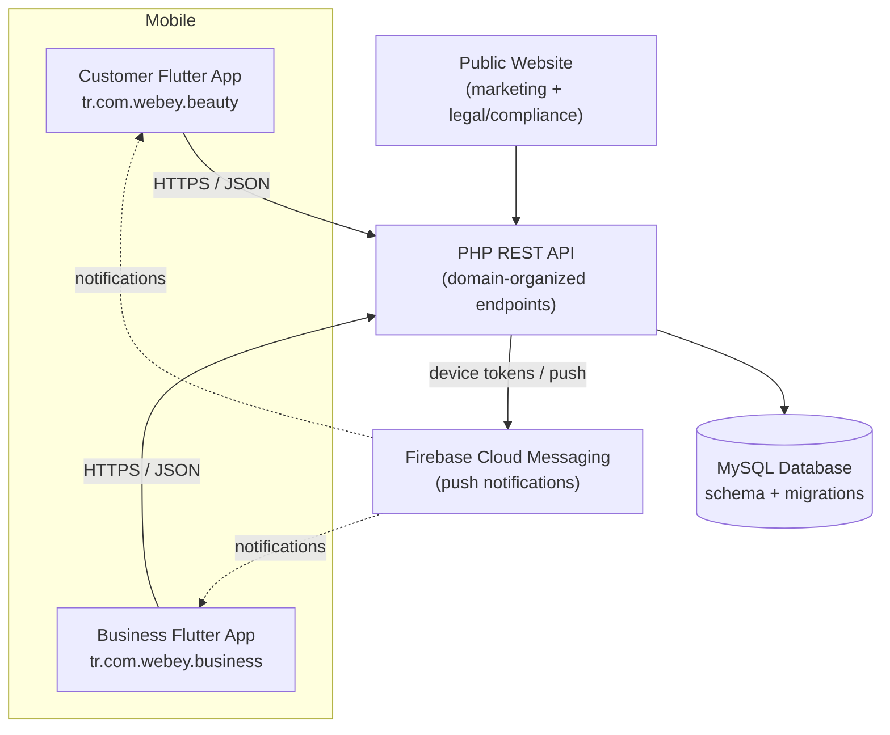
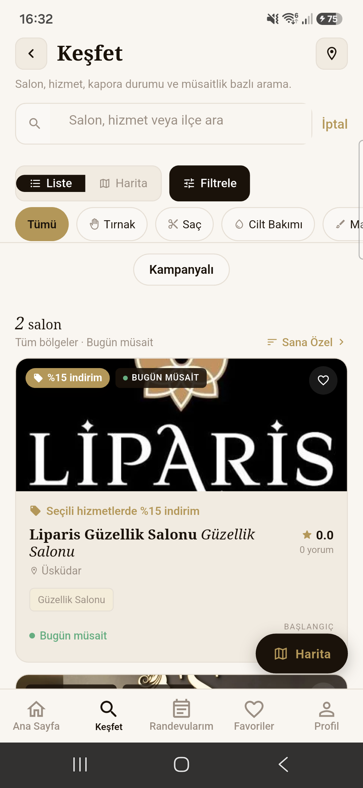
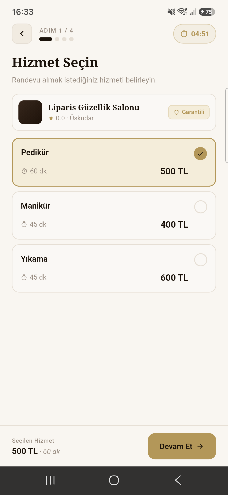
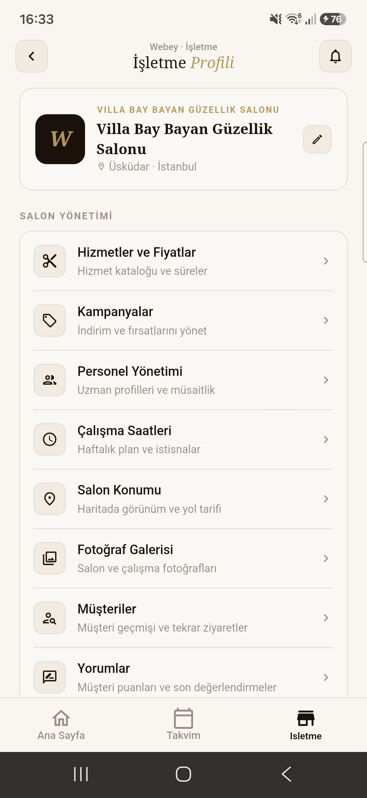
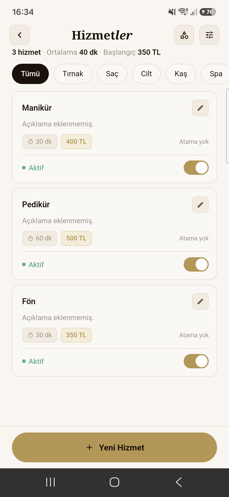

# Webey

**Webey** is a full-stack, two-sided appointment booking and business management
platform for the beauty and personal-care industry. It pairs two Flutter mobile
apps — one for customers, one for businesses — with a PHP REST API, a MySQL
database, and Firebase Cloud Messaging for push notifications.

> This repository is a **portfolio-safe** public version of a commercial product.
> Production credentials, signing keys, private deployment configuration, and user
> data are intentionally excluded. See [Security Notes](#security-notes).

---

## Product Overview

Webey connects two audiences around the same booking domain:

- **Customers** discover salons, browse services and staff, book appointments,
  follow campaigns, manage deposits and cancellations, and receive notifications.
- **Businesses** manage their profile, services, staff, gallery, bookings,
  campaigns, deposit and cancellation policies, and notification preferences.

A shared PHP API and MySQL schema back both apps, while a public marketing and
legal/compliance website rounds out the platform.

Known mobile application IDs:

| App          | Package ID             |
|--------------|------------------------|
| Customer app | `tr.com.webey.beauty`  |
| Business app | `tr.com.webey.business`|

---

## Core Features

### Customer App
- Salon discovery and listing
- Search and filtering
- Salon profile pages
- Staff discovery
- Appointment booking
- Availability / time-slot selection
- Favorites
- Campaign visibility
- Deposit information
- Cancellation flow
- Push notifications

### Business App
- Business profile management
- Service management
- Staff management
- Staff profile photos
- Gallery management
- Appointment management
- Campaign management
- Deposit policies
- Cancellation policies
- Notification settings

### Backend (confirmed from source)
- REST-style PHP API organized by domain (`auth`, `appointments`, `business`,
  `services`, `staff`, `calendar`, `billing`, `notifications`, `push`, `profile`,
  `session`, `settings`, `public`, `admin`, `superadmin`, plus a dedicated
  `mobile` namespace).
- MySQL data layer with a versioned migration history (`database/migrations`).
- PDO with prepared statements and strict error mode.
- Email delivery via SMTP / Brevo; SMS via pluggable providers
  (NetGSM / İletimerkezi / Verimor).
- OTP-gated registration and password-reset flows.
- Firebase Cloud Messaging device-token registration and push delivery.
- CSRF protection, security headers, and a super-admin panel.

---

## Architecture



---

## Tech Stack

**Mobile (Flutter / Dart)**
- Flutter (Dart SDK `^3.11`), Material Design
- `http` for API communication
- `flutter_secure_storage`, `shared_preferences` for local persistence
- `firebase_core`, `firebase_messaging` for push notifications
- `flutter_map` + `latlong2` for maps, `geolocator` + `geocoding` for location
- `image_picker`, `url_launcher`, `package_info_plus`
- `flutter_lints` for static analysis

**Backend**
- PHP (PDO + MySQL, prepared statements, strict mode)
- MySQL with versioned SQL migrations
- SMTP / Brevo email, pluggable SMS providers
- Firebase Cloud Messaging (server-side push)

**Web**
- Static HTML/CSS/JS marketing and compliance site
- Service worker / PWA manifest

---

## Repository Structure

```
webey-public-portfolio/
├── webey-mobile/        # Flutter monorepo: Customer + Business apps (flavors)
│   ├── lib/
│   │   ├── app/         # App shell, routing, entry wiring
│   │   ├── core/        # Config, storage, theme
│   │   ├── features/    # auth, customer, business, splash (feature-first)
│   │   └── shared/      # models, services, widgets, mock data, utils
│   ├── android/         # Android project (signing config via key.properties)
│   ├── ios/             # iOS project
│   ├── test/            # Widget / unit tests
│   └── pubspec.yaml
├── webey-site/          # PHP API + MySQL schema + public website
│   ├── api/             # Domain-organized REST endpoints
│   ├── database/        # schema.sql + migrations/
│   ├── core/ css/ js/   # Shared web assets
│   └── *.html           # Marketing + legal/compliance pages
├── docs/                # Architecture, setup, and portfolio notes
├── assets/screenshots/  # Placeholders for app screenshots
└── .github/workflows/   # CI: Flutter analyze/test + PHP lint
```

Two mobile entry points (`main_customer.dart`, `main_business.dart`) drive the
two apps from a single codebase using Flutter build flavors.

---

## Local Setup

A condensed guide follows; see [`docs/setup.md`](docs/setup.md) for full detail.
All values shown are **placeholders** — never use real credentials.

### Prerequisites
- Flutter SDK (Dart `^3.11`) and Android Studio / Xcode toolchains
- PHP 8.x and MySQL 8.x for the backend
- A Firebase project (for push notifications)

### Run the Customer app
```bash
cd webey-mobile
flutter pub get
flutter run -t lib/main_customer.dart --flavor customer
```

### Run the Business app
```bash
cd webey-mobile
flutter run -t lib/main_business.dart --flavor business
```

> Place your own `android/app/google-services.json` (see
> `google-services.json.example`) and `android/key.properties`
> (see `key.properties.example`) before building release artifacts.

### Backend configuration
1. Point a PHP 8 server at `webey-site/`.
2. Configure the database via environment variables (see `.env.example`):
   `DB_HOST`, `DB_NAME`, `DB_USER`, `DB_PASS`.
3. For email/SMS/payments, set the corresponding env vars or copy the example
   config files (`_iyzico_config.php.example`, `api/keys/email.php.example`) to
   their real names and fill in your own keys.

### Database configuration
```bash
mysql -u <user> -p <db_name> < webey-site/database/schema.sql
# then apply migrations in date order:
#   webey-site/database/migrations/*.sql
```

### Environment variables
Copy `.env.example` and provide values through your server environment
(Apache `SetEnv`, Nginx `fastcgi_param`, or cPanel Environment Variables).
`webey-site/db.php` reads these and falls back to safe local defaults.

---

## Security Notes

Production credentials, private keys, deployment configuration, and user data are
**intentionally excluded** from this public repository. Specifically removed or
replaced with examples:

- Database, SMTP/Brevo, SMS, and iyzico payment credentials
- The real `api/keys/` secret store and `_iyzico_config.php`
- Android signing keystore (`*.jks`) and `key.properties`
- `google-services.json` Firebase project configuration
- Uploaded user content, deployment archives, logs, and build artifacts

The Git history is **fresh** — it does not carry any of the original project's
history that might contain secrets. See [`SECURITY.md`](SECURITY.md).

---

## Mobile App Screenshots

The following screenshots were captured from the current Android test builds and illustrate representative customer and business workflows. Sensitive account, payment, and customer information is intentionally excluded.

### Customer App





### Business App





---

## Project Status

Actively developed product. Public repository is maintained as a portfolio-safe
version and may not include production infrastructure or confidential
configuration.

---

## License

No open-source license is granted. This repository is shared for **portfolio and
evaluation purposes only**. **All rights reserved.** Please do not reuse,
redistribute, or deploy this code without explicit permission from the author.
