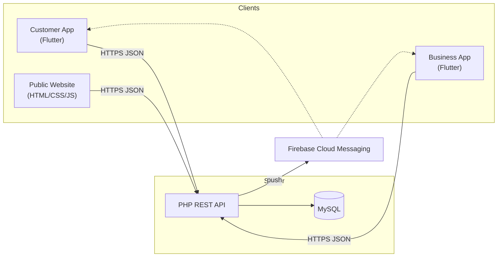

# Architecture

A high-level view of the Webey platform. This document intentionally avoids
exposing production endpoints, hostnames, or infrastructure details.

## System overview

Webey is a two-sided platform: a **Customer** app and a **Business** app, both
built from one Flutter codebase, talking to a shared **PHP REST API** backed by
**MySQL**, with **Firebase Cloud Messaging** for push delivery and a **public
website** for marketing and legal/compliance pages.

## Mobile architecture

- **Single codebase, two apps.** Build flavors (`customer`, `business`) with
  distinct entry points (`lib/main_customer.dart`, `lib/main_business.dart`) and
  package IDs (`tr.com.webey.beauty`, `tr.com.webey.business`).
- **Feature-first layering** under `lib/`:
  - `app/` — application shell, routing, top-level wiring.
  - `core/` — configuration, secure/local storage, theming.
  - `features/` — `auth`, `customer`, `business`, `splash`; each feature holds
    its own `data` and `presentation` layers.
  - `shared/` — models, services, reusable widgets, utilities, and mock data.
- **Networking** via `http` against the REST API, with tokens held in
  `flutter_secure_storage`.
- **Location & maps** via `geolocator`/`geocoding` and `flutter_map` + `latlong2`.
- **Push** via `firebase_core` + `firebase_messaging`, registering device tokens
  with the backend.

## Backend architecture

- **Domain-organized endpoints** under `webey-site/api/`: `auth`, `appointments`,
  `business`, `services`, `staff`, `calendar`, `billing`, `notifications`,
  `push`, `profile`, `session`, `settings`, `public`, `admin`, `superadmin`, and
  a dedicated `mobile` namespace for app-specific flows.
- **Data access** through PDO with prepared statements, strict error mode, and a
  central bootstrap (`db.php`) that reads connection settings from environment
  variables with safe local fallbacks.
- **Auth & sessions** include OTP-gated registration, password reset, mobile
  session handling, and CSRF protection.
- **Notifications** combine transactional email (SMTP / Brevo), SMS (pluggable
  providers), and Firebase push.

## Data model

The schema is captured in `webey-site/database/schema.sql` and evolved through
dated, mostly idempotent migrations in `webey-site/database/migrations/`.
Major domains include businesses, services, staff, appointments, deposits and
payments, reviews, favorites, campaigns, subscriptions/boost, notifications, and
device tokens.

## Configuration & secrets

All secrets are supplied at runtime via environment variables or a git-ignored
local secret store (`api/keys/`). The repository ships only `*.example` templates
— see `.env.example`, `_iyzico_config.php.example`, `key.properties.example`,
`google-services.json.example`, and `api/keys/email.php.example`.
